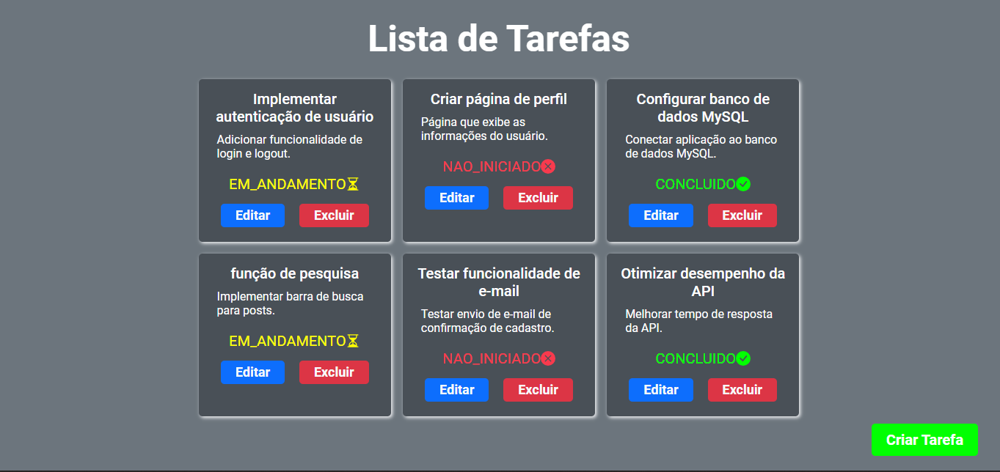
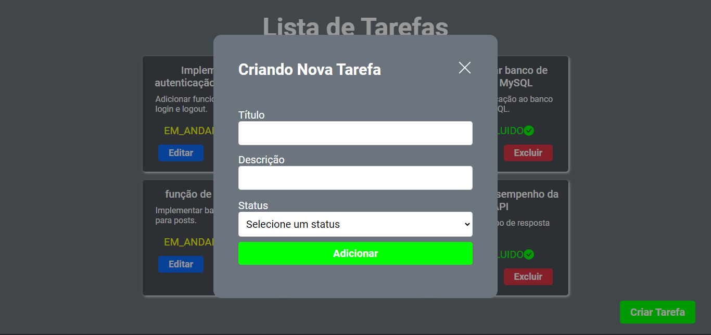
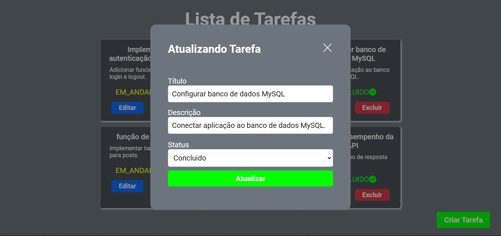

# Teste Técnico: Lista de Tarefas

# Sobre o projeto

Este projeto é uma aplicação de lista de tarefas (To-Do List) que utiliza Spring Boot no backend, um banco de dados MySQL e um frontend construído com ReactJS. A aplicação é contêinerizada usando Docker.

# Tecnologias utilizadas
- Java
- Spring Boot
- MySQL
- JavaScript
- React

# Imagens
   
   
   
   
# Como executar o projeto
## Pré-requisitos
- Docker
- Docker Compose

```bash
# Clonar repositório:
git clone https://github.com/GabrielApolinario08/to-do-list-stefanini.git
cd to-do-list-stefanini

# Use Docker Compose para construir e iniciar os contêineres:
docker-compose up --build
```
##Acesse a aplicação
Frontend: http://localhost:80
Backend: http://localhost:8080

# Endpoints da API
| Método  | Endpoint | Descrição |
| ------------- | ------------- | ------------- |
| GET  | /tarefas  | Retorna uma lista de todas as tarefas.  |
| GET  | /tarefas/{tarefaId}  | Retorna uma tarefa específica com base no ID fornecido.  |
| POST  | /tarefas  | Cria uma nova tarefa com base nos dados fornecidos no corpo da requisição.  |
| PUT  | /tarefas/{tarefaId}  | Atualiza uma tarefa existente com base no ID fornecido e os novos dados passados no corpo da requisição.  |
| DELETE  | /tarefas/{tarefaId}  | Deleta uma tarefa existente com base no ID fornecido.  |

# Autor

Gabriel Apolinário Fabrício

www.linkedin.com/in/gabrielapolinariofabricio
